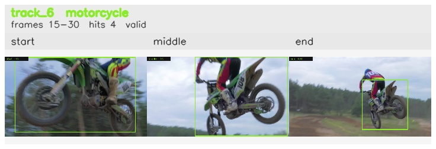

# davis__motorcycle_jump__motocross_jump / track_6

## Summary
- class: motorcycle (3)
- frames: 15-30 (16 frame span)
- hits: 4
- valid track: yes
- had recovery: no
- relinked from: none
- fragment track ids: 6
- avg visual similarity: 0.7812
- total misses: 1
- max miss streak: 1

## Label Mix
- motorcycle (3): 4 detections, confidence sum 2.875

## Relink Edges
- none

## Event Timeline
- frame 15: created
- frame 20: activated
- frame 30: closed
- frame 35: lost

## Key Frames
- start: frame 15, fragment 6, [image](frames/start_f0015.jpg)
- middle: frame 25, fragment 6, [image](frames/middle_f0025.jpg)
- end: frame 30, fragment 6, [image](frames/end_f0030.jpg)

[track metadata](track.json)
