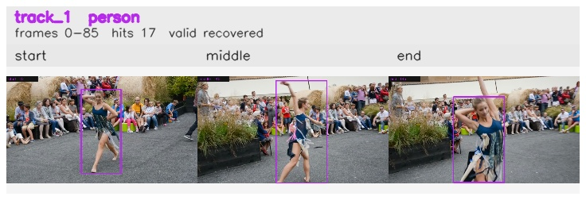

# davis__person_distractor__dance_twirl / track_1

## Summary
- class: person (0)
- frames: 0-85 (86 frame span)
- hits: 17
- valid track: yes
- had recovery: yes
- relinked from: none
- fragment track ids: 1
- avg visual similarity: 0.9211
- total misses: 1
- max miss streak: 1

## Label Mix
- person (0): 17 detections, confidence sum 14.544

## Relink Edges
- none

## Event Timeline
- frame 0: created
- frame 5: activated
- frame 60: lost
- frame 65: recovered
- frame 85: closed

## Key Frames
- start: frame 0, fragment 1, [image](frames/start_f0000.jpg)
- middle: frame 40, fragment 1, [image](frames/middle_f0040.jpg)
- end: frame 85, fragment 1, [image](frames/end_f0085.jpg)

[track metadata](track.json)
