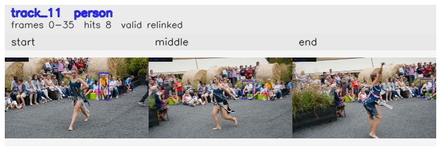

# davis__person_distractor__dance_twirl / track_11

## Summary
- class: person (0)
- frames: 0-35 (36 frame span)
- hits: 8
- valid track: yes
- had recovery: no
- relinked from: 33
- fragment track ids: 11, 33
- avg visual similarity: 0.8759
- total misses: 14
- max miss streak: 7

## Label Mix
- person (0): 8 detections, confidence sum 4.526

## Relink Edges
- 11 -> 33 via dino (score 0.7826)

## Event Timeline
- frame 0: created
- frame 5: activated
- frame 15: closed
- frame 20: created
- frame 20: lost
- frame 25: activated
- frame 35: closed
- frame 40: lost

## Key Frames
- start: frame 0, fragment 11, [image](frames/start_f0000.jpg)
- middle: frame 20, fragment 33, [image](frames/middle_f0020.jpg)
- end: frame 35, fragment 33, [image](frames/end_f0035.jpg)

[track metadata](track.json)
