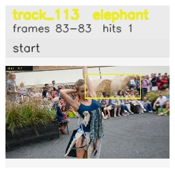

# davis__person_distractor__dance_twirl / track_113

## Summary
- class: elephant (20)
- frames: 83-83 (1 frame span)
- hits: 1
- valid track: no
- had recovery: no
- relinked from: none
- fragment track ids: 113
- avg visual similarity: n/a
- total misses: 6
- max miss streak: 6

## Label Mix
- elephant (20): 1 detections, confidence sum 0.330

## Relink Edges
- none

## Event Timeline
- frame 83: closed
- frame 83: created
- frame 84: lost

## Key Frames
- start: frame 83, fragment 113, [image](frames/start_f0083.jpg)

[track metadata](track.json)
