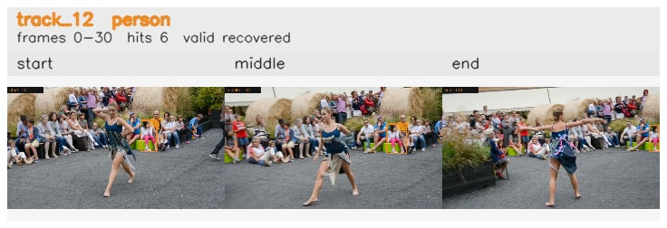

# davis__person_distractor__dance_twirl / track_12

## Summary
- class: person (0)
- frames: 0-30 (31 frame span)
- hits: 6
- valid track: yes
- had recovery: yes
- relinked from: none
- fragment track ids: 12
- avg visual similarity: 0.8598
- total misses: 8
- max miss streak: 7

## Label Mix
- person (0): 6 detections, confidence sum 2.269

## Relink Edges
- none

## Event Timeline
- frame 0: created
- frame 5: activated
- frame 20: lost
- frame 25: recovered
- frame 30: closed
- frame 35: lost

## Key Frames
- start: frame 0, fragment 12, [image](frames/start_f0000.jpg)
- middle: frame 15, fragment 12, [image](frames/middle_f0015.jpg)
- end: frame 30, fragment 12, [image](frames/end_f0030.jpg)

[track metadata](track.json)
