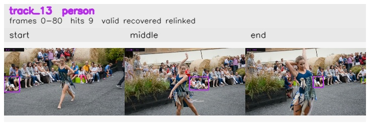

# davis__person_distractor__dance_twirl / track_13

## Summary
- class: person (0)
- frames: 0-80 (81 frame span)
- hits: 9
- valid track: yes
- had recovery: yes
- relinked from: 66
- fragment track ids: 13, 66
- avg visual similarity: 0.8668
- total misses: 10
- max miss streak: 7

## Label Mix
- person (0): 9 detections, confidence sum 3.128

## Relink Edges
- 13 -> 66 via dino (score 0.9053)

## Event Timeline
- frame 0: created
- frame 5: activated
- frame 10: lost
- frame 15: closed
- frame 15: recovered
- frame 20: lost
- frame 50: created
- frame 55: activated
- frame 60: lost
- frame 65: recovered
- frame 80: closed
- frame 85: lost

## Key Frames
- start: frame 0, fragment 13, [image](frames/start_f0000.jpg)
- middle: frame 55, fragment 66, [image](frames/middle_f0055.jpg)
- end: frame 80, fragment 66, [image](frames/end_f0080.jpg)

[track metadata](track.json)
