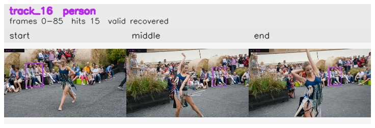

# davis__person_distractor__dance_twirl / track_16

## Summary
- class: person (0)
- frames: 0-85 (86 frame span)
- hits: 15
- valid track: yes
- had recovery: yes
- relinked from: none
- fragment track ids: 16
- avg visual similarity: 0.8784
- total misses: 3
- max miss streak: 3

## Label Mix
- person (0): 15 detections, confidence sum 7.527

## Relink Edges
- none

## Event Timeline
- frame 0: created
- frame 5: activated
- frame 20: lost
- frame 35: recovered
- frame 85: closed

## Key Frames
- start: frame 0, fragment 16, [image](frames/start_f0000.jpg)
- middle: frame 50, fragment 16, [image](frames/middle_f0050.jpg)
- end: frame 85, fragment 16, [image](frames/end_f0085.jpg)

[track metadata](track.json)
