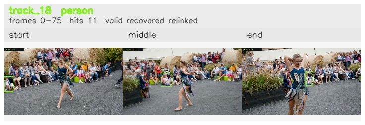

# davis__person_distractor__dance_twirl / track_18

## Summary
- class: person (0)
- frames: 0-75 (76 frame span)
- hits: 11
- valid track: yes
- had recovery: yes
- relinked from: 27, 68
- fragment track ids: 18, 27, 68
- avg visual similarity: 0.8646
- total misses: 17
- max miss streak: 7

## Label Mix
- person (0): 11 detections, confidence sum 4.921

## Relink Edges
- 18 -> 27 via dino (score 0.8504)
- 27 -> 68 via dino (score 0.8370)

## Event Timeline
- frame 0: created
- frame 5: activated
- frame 5: closed
- frame 10: created
- frame 10: lost
- frame 15: activated
- frame 30: closed
- frame 35: lost
- frame 55: created
- frame 60: activated
- frame 65: lost
- frame 70: recovered
- frame 75: closed
- frame 80: lost

## Key Frames
- start: frame 0, fragment 18, [image](frames/start_f0000.jpg)
- middle: frame 25, fragment 27, [image](frames/middle_f0025.jpg)
- end: frame 75, fragment 68, [image](frames/end_f0075.jpg)

[track metadata](track.json)
