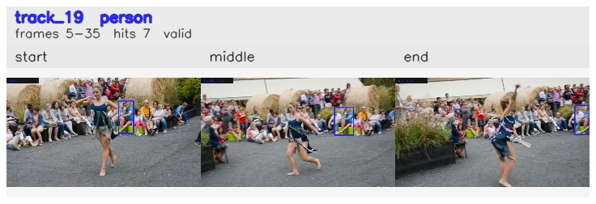

# davis__person_distractor__dance_twirl / track_19

## Summary
- class: person (0)
- frames: 5-35 (31 frame span)
- hits: 7
- valid track: yes
- had recovery: no
- relinked from: none
- fragment track ids: 19
- avg visual similarity: 0.8422
- total misses: 7
- max miss streak: 7

## Label Mix
- person (0): 7 detections, confidence sum 3.642

## Relink Edges
- none

## Event Timeline
- frame 5: created
- frame 10: activated
- frame 35: closed
- frame 40: lost

## Key Frames
- start: frame 5, fragment 19, [image](frames/start_f0005.jpg)
- middle: frame 20, fragment 19, [image](frames/middle_f0020.jpg)
- end: frame 35, fragment 19, [image](frames/end_f0035.jpg)

[track metadata](track.json)
