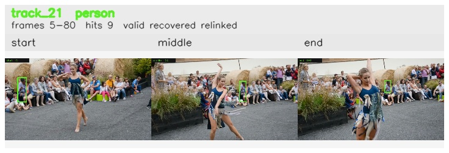

# davis__person_distractor__dance_twirl / track_21

## Summary
- class: person (0)
- frames: 5-80 (76 frame span)
- hits: 9
- valid track: yes
- had recovery: yes
- relinked from: 65, 75
- fragment track ids: 21, 65, 75
- avg visual similarity: 0.8222
- total misses: 14
- max miss streak: 7

## Label Mix
- person (0): 9 detections, confidence sum 2.785

## Relink Edges
- 21 -> 65 via dino (score 0.9095)
- 65 -> 75 via dino (score 0.6520)

## Event Timeline
- frame 5: created
- frame 10: activated
- frame 20: lost
- frame 25: closed
- frame 25: recovered
- frame 30: lost
- frame 50: created
- frame 55: activated
- frame 60: lost
- frame 65: closed
- frame 65: recovered
- frame 70: lost
- frame 75: created
- frame 80: activated
- frame 80: closed
- frame 85: lost

## Key Frames
- start: frame 5, fragment 21, [image](frames/start_f0005.jpg)
- middle: frame 50, fragment 65, [image](frames/middle_f0050.jpg)
- end: frame 80, fragment 75, [image](frames/end_f0080.jpg)

[track metadata](track.json)
