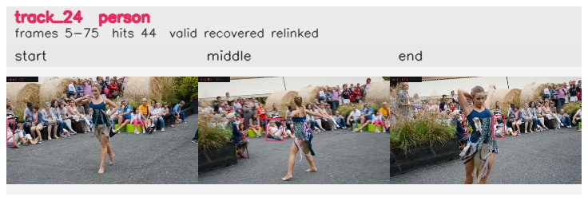

# davis__person_distractor__dance_twirl / track_24

## Summary
- class: person (0)
- frames: 5-75 (71 frame span)
- hits: 44
- valid track: yes
- had recovery: yes
- relinked from: 90
- fragment track ids: 24, 90
- avg visual similarity: 0.9167
- total misses: 22
- max miss streak: 7

## Label Mix
- person (0): 44 detections, confidence sum 22.433

## Relink Edges
- 24 -> 90 via dino (score 0.8840)

## Event Timeline
- frame 5: created
- frame 6: activated
- frame 31: lost
- frame 32: closed
- frame 32: recovered
- frame 33: lost
- frame 52: created
- frame 53: lost
- frame 54: recovered
- frame 64: lost
- frame 69: recovered
- frame 74: lost
- frame 75: closed
- frame 75: recovered
- frame 76: lost

## Key Frames
- start: frame 5, fragment 24, [image](frames/start_f0005.jpg)
- middle: frame 27, fragment 24, [image](frames/middle_f0027.jpg)
- end: frame 75, fragment 90, [image](frames/end_f0075.jpg)

[track metadata](track.json)
