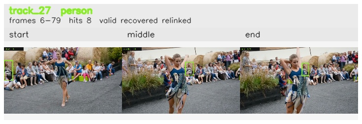

# davis__person_distractor__dance_twirl / track_27

## Summary
- class: person (0)
- frames: 6-79 (74 frame span)
- hits: 8
- valid track: yes
- had recovery: yes
- relinked from: 97, 109
- fragment track ids: 27, 97, 109
- avg visual similarity: 0.8150
- total misses: 23
- max miss streak: 7

## Label Mix
- person (0): 8 detections, confidence sum 2.446

## Relink Edges
- 27 -> 97 via dino (score 0.8273)
- 97 -> 109 via dino (score 0.8858)

## Event Timeline
- frame 6: created
- frame 7: activated
- frame 7: closed
- frame 8: lost
- frame 57: created
- frame 58: activated
- frame 58: closed
- frame 59: lost
- frame 74: created
- frame 75: activated
- frame 76: lost
- frame 78: recovered
- frame 79: closed
- frame 80: lost

## Key Frames
- start: frame 6, fragment 27, [image](frames/start_f0006.jpg)
- middle: frame 74, fragment 109, [image](frames/middle_f0074.jpg)
- end: frame 79, fragment 109, [image](frames/end_f0079.jpg)

[track metadata](track.json)
