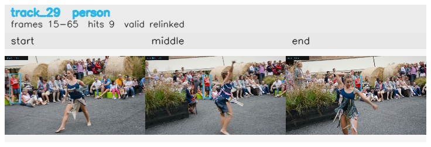

# davis__person_distractor__dance_twirl / track_29

## Summary
- class: person (0)
- frames: 15-65 (51 frame span)
- hits: 9
- valid track: yes
- had recovery: no
- relinked from: 69
- fragment track ids: 29, 69
- avg visual similarity: 0.7775
- total misses: 11
- max miss streak: 7

## Label Mix
- person (0): 9 detections, confidence sum 4.422

## Relink Edges
- 29 -> 69 via dino (score 0.7767)

## Event Timeline
- frame 15: created
- frame 20: activated
- frame 40: closed
- frame 45: lost
- frame 55: created
- frame 60: activated
- frame 65: closed
- frame 70: lost

## Key Frames
- start: frame 15, fragment 29, [image](frames/start_f0015.jpg)
- middle: frame 35, fragment 29, [image](frames/middle_f0035.jpg)
- end: frame 65, fragment 69, [image](frames/end_f0065.jpg)

[track metadata](track.json)
