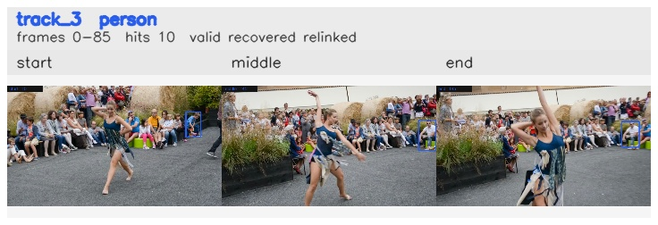

# davis__person_distractor__dance_twirl / track_3

## Summary
- class: person (0)
- frames: 0-85 (86 frame span)
- hits: 10
- valid track: yes
- had recovery: yes
- relinked from: 30
- fragment track ids: 3, 30
- avg visual similarity: 0.8308
- total misses: 15
- max miss streak: 7

## Label Mix
- person (0): 10 detections, confidence sum 6.651

## Relink Edges
- 3 -> 30 via dino (score 0.6718)

## Event Timeline
- frame 0: created
- frame 5: activated
- frame 10: closed
- frame 15: created
- frame 15: lost
- frame 20: lost
- frame 40: recovered
- frame 55: lost
- frame 75: recovered
- frame 85: closed

## Key Frames
- start: frame 0, fragment 3, [image](frames/start_f0000.jpg)
- middle: frame 45, fragment 30, [image](frames/middle_f0045.jpg)
- end: frame 85, fragment 30, [image](frames/end_f0085.jpg)

[track metadata](track.json)
