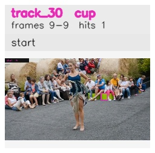

# davis__person_distractor__dance_twirl / track_30

## Summary
- class: cup (41)
- frames: 9-9 (1 frame span)
- hits: 1
- valid track: no
- had recovery: no
- relinked from: none
- fragment track ids: 30
- avg visual similarity: n/a
- total misses: 7
- max miss streak: 7

## Label Mix
- cup (41): 1 detections, confidence sum 0.306

## Relink Edges
- none

## Event Timeline
- frame 9: closed
- frame 9: created
- frame 10: lost

## Key Frames
- start: frame 9, fragment 30, [image](frames/start_f0009.jpg)

[track metadata](track.json)
