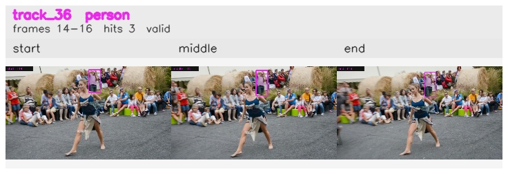

# davis__person_distractor__dance_twirl / track_36

## Summary
- class: person (0)
- frames: 14-16 (3 frame span)
- hits: 3
- valid track: yes
- had recovery: no
- relinked from: none
- fragment track ids: 36
- avg visual similarity: 0.8519
- total misses: 7
- max miss streak: 7

## Label Mix
- person (0): 3 detections, confidence sum 1.187

## Relink Edges
- none

## Event Timeline
- frame 14: created
- frame 15: activated
- frame 16: closed
- frame 17: lost

## Key Frames
- start: frame 14, fragment 36, [image](frames/start_f0014.jpg)
- middle: frame 15, fragment 36, [image](frames/middle_f0015.jpg)
- end: frame 16, fragment 36, [image](frames/end_f0016.jpg)

[track metadata](track.json)
