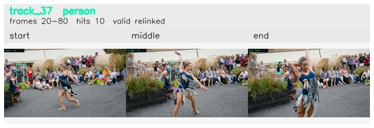

# davis__person_distractor__dance_twirl / track_37

## Summary
- class: person (0)
- frames: 20-80 (61 frame span)
- hits: 10
- valid track: yes
- had recovery: no
- relinked from: 73
- fragment track ids: 37, 73
- avg visual similarity: 0.8472
- total misses: 8
- max miss streak: 7

## Label Mix
- person (0): 10 detections, confidence sum 3.805

## Relink Edges
- 37 -> 73 via dino (score 0.6382)

## Event Timeline
- frame 20: created
- frame 25: activated
- frame 45: closed
- frame 50: lost
- frame 65: created
- frame 70: activated
- frame 80: closed
- frame 85: lost

## Key Frames
- start: frame 20, fragment 37, [image](frames/start_f0020.jpg)
- middle: frame 45, fragment 37, [image](frames/middle_f0045.jpg)
- end: frame 80, fragment 73, [image](frames/end_f0080.jpg)

[track metadata](track.json)
