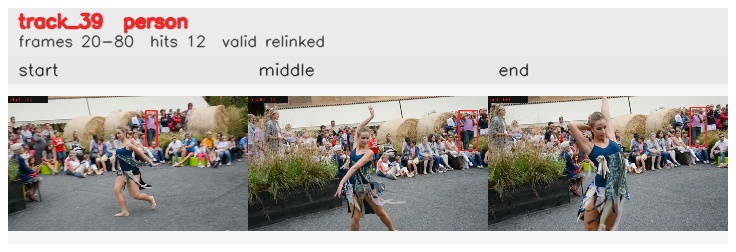

# davis__person_distractor__dance_twirl / track_39

## Summary
- class: person (0)
- frames: 20-80 (61 frame span)
- hits: 12
- valid track: yes
- had recovery: no
- relinked from: 60
- fragment track ids: 39, 60
- avg visual similarity: 0.8453
- total misses: 8
- max miss streak: 7

## Label Mix
- person (0): 12 detections, confidence sum 4.675

## Relink Edges
- 39 -> 60 via dino (score 0.8981)

## Event Timeline
- frame 20: created
- frame 25: activated
- frame 30: closed
- frame 35: lost
- frame 40: created
- frame 45: activated
- frame 80: closed
- frame 85: lost

## Key Frames
- start: frame 20, fragment 39, [image](frames/start_f0020.jpg)
- middle: frame 55, fragment 60, [image](frames/middle_f0055.jpg)
- end: frame 80, fragment 60, [image](frames/end_f0080.jpg)

[track metadata](track.json)
