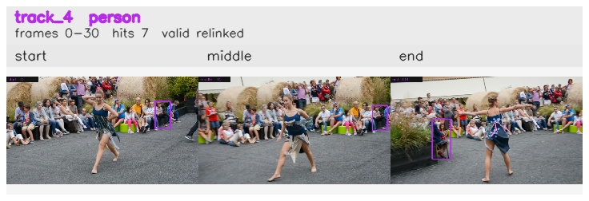

# davis__person_distractor__dance_twirl / track_4

## Summary
- class: person (0)
- frames: 0-30 (31 frame span)
- hits: 7
- valid track: yes
- had recovery: no
- relinked from: 35
- fragment track ids: 4, 35
- avg visual similarity: 0.8724
- total misses: 14
- max miss streak: 7

## Label Mix
- person (0): 7 detections, confidence sum 3.755

## Relink Edges
- 4 -> 35 via dino (score 0.6478)

## Event Timeline
- frame 0: created
- frame 5: activated
- frame 15: closed
- frame 20: created
- frame 20: lost
- frame 25: activated
- frame 30: closed
- frame 35: lost

## Key Frames
- start: frame 0, fragment 4, [image](frames/start_f0000.jpg)
- middle: frame 15, fragment 4, [image](frames/middle_f0015.jpg)
- end: frame 30, fragment 35, [image](frames/end_f0030.jpg)

[track metadata](track.json)
