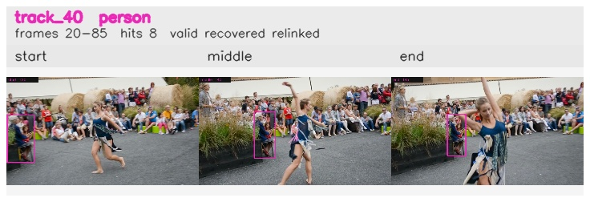

# davis__person_distractor__dance_twirl / track_40

## Summary
- class: person (0)
- frames: 20-85 (66 frame span)
- hits: 8
- valid track: yes
- had recovery: yes
- relinked from: 56
- fragment track ids: 40, 56
- avg visual similarity: 0.8565
- total misses: 13
- max miss streak: 7

## Label Mix
- person (0): 8 detections, confidence sum 3.708

## Relink Edges
- 40 -> 56 via dino (score 0.9121)

## Event Timeline
- frame 20: created
- frame 25: activated
- frame 35: closed
- frame 40: created
- frame 40: lost
- frame 45: activated
- frame 50: lost
- frame 80: recovered
- frame 85: closed

## Key Frames
- start: frame 20, fragment 40, [image](frames/start_f0020.jpg)
- middle: frame 40, fragment 56, [image](frames/middle_f0040.jpg)
- end: frame 85, fragment 56, [image](frames/end_f0085.jpg)

[track metadata](track.json)
