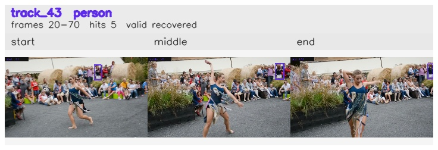

# davis__person_distractor__dance_twirl / track_43

## Summary
- class: person (0)
- frames: 20-70 (51 frame span)
- hits: 5
- valid track: yes
- had recovery: yes
- relinked from: none
- fragment track ids: 43
- avg visual similarity: 0.7897
- total misses: 9
- max miss streak: 3

## Label Mix
- person (0): 5 detections, confidence sum 1.445

## Relink Edges
- none

## Event Timeline
- frame 20: created
- frame 25: lost
- frame 30: recovered
- frame 35: lost
- frame 45: recovered
- frame 50: lost
- frame 55: recovered
- frame 60: lost
- frame 70: closed
- frame 70: recovered
- frame 75: lost

## Key Frames
- start: frame 20, fragment 43, [image](frames/start_f0020.jpg)
- middle: frame 45, fragment 43, [image](frames/middle_f0045.jpg)
- end: frame 70, fragment 43, [image](frames/end_f0070.jpg)

[track metadata](track.json)
