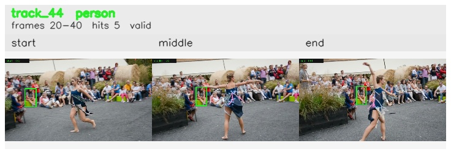

# davis__person_distractor__dance_twirl / track_44

## Summary
- class: person (0)
- frames: 20-40 (21 frame span)
- hits: 5
- valid track: yes
- had recovery: no
- relinked from: none
- fragment track ids: 44
- avg visual similarity: 0.8180
- total misses: 7
- max miss streak: 7

## Label Mix
- person (0): 5 detections, confidence sum 2.101

## Relink Edges
- none

## Event Timeline
- frame 20: created
- frame 25: activated
- frame 40: closed
- frame 45: lost

## Key Frames
- start: frame 20, fragment 44, [image](frames/start_f0020.jpg)
- middle: frame 30, fragment 44, [image](frames/middle_f0030.jpg)
- end: frame 40, fragment 44, [image](frames/end_f0040.jpg)

[track metadata](track.json)
