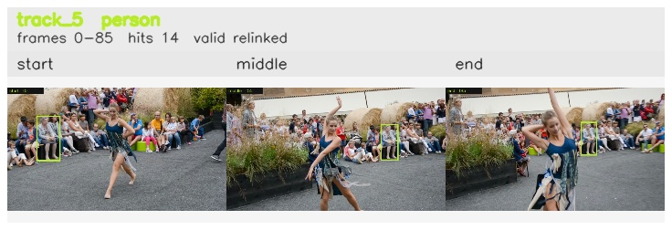

# davis__person_distractor__dance_twirl / track_5

## Summary
- class: person (0)
- frames: 0-85 (86 frame span)
- hits: 14
- valid track: yes
- had recovery: no
- relinked from: 57
- fragment track ids: 5, 57
- avg visual similarity: 0.8519
- total misses: 7
- max miss streak: 7

## Label Mix
- person (0): 14 detections, confidence sum 9.211

## Relink Edges
- 5 -> 57 via dino (score 0.9544)

## Event Timeline
- frame 0: created
- frame 5: activated
- frame 15: closed
- frame 20: lost
- frame 40: created
- frame 45: activated
- frame 85: closed

## Key Frames
- start: frame 0, fragment 5, [image](frames/start_f0000.jpg)
- middle: frame 55, fragment 57, [image](frames/middle_f0055.jpg)
- end: frame 85, fragment 57, [image](frames/end_f0085.jpg)

[track metadata](track.json)
