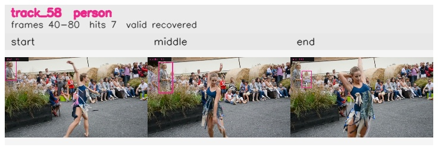

# davis__person_distractor__dance_twirl / track_58

## Summary
- class: person (0)
- frames: 40-80 (41 frame span)
- hits: 7
- valid track: yes
- had recovery: yes
- relinked from: none
- fragment track ids: 58
- avg visual similarity: 0.8974
- total misses: 3
- max miss streak: 1

## Label Mix
- person (0): 7 detections, confidence sum 2.113

## Relink Edges
- none

## Event Timeline
- frame 40: created
- frame 45: activated
- frame 50: lost
- frame 55: recovered
- frame 75: lost
- frame 80: closed
- frame 80: recovered
- frame 85: lost

## Key Frames
- start: frame 40, fragment 58, [image](frames/start_f0040.jpg)
- middle: frame 60, fragment 58, [image](frames/middle_f0060.jpg)
- end: frame 80, fragment 58, [image](frames/end_f0080.jpg)

[track metadata](track.json)
