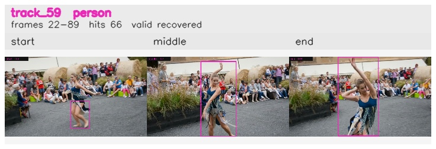

# davis__person_distractor__dance_twirl / track_59

## Summary
- class: person (0)
- frames: 22-89 (68 frame span)
- hits: 66
- valid track: yes
- had recovery: yes
- relinked from: none
- fragment track ids: 59
- avg visual similarity: 0.9712
- total misses: 2
- max miss streak: 1

## Label Mix
- person (0): 66 detections, confidence sum 53.161

## Relink Edges
- none

## Event Timeline
- frame 22: created
- frame 23: lost
- frame 24: recovered
- frame 26: lost
- frame 27: recovered
- frame 89: closed

## Key Frames
- start: frame 22, fragment 59, [image](frames/start_f0022.jpg)
- middle: frame 57, fragment 59, [image](frames/middle_f0057.jpg)
- end: frame 89, fragment 59, [image](frames/end_f0089.jpg)

[track metadata](track.json)
