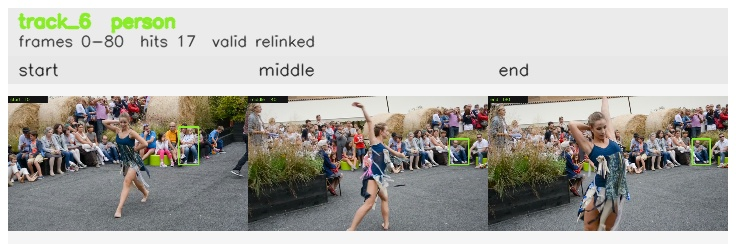

# davis__person_distractor__dance_twirl / track_6

## Summary
- class: person (0)
- frames: 0-80 (81 frame span)
- hits: 17
- valid track: yes
- had recovery: no
- relinked from: 24, 36
- fragment track ids: 6, 24, 36
- avg visual similarity: 0.8509
- total misses: 15
- max miss streak: 7

## Label Mix
- person (0): 17 detections, confidence sum 10.346

## Relink Edges
- 6 -> 24 via dino (score 0.9388)
- 24 -> 36 via dino (score 0.7099)

## Event Timeline
- frame 0: created
- frame 5: activated
- frame 5: closed
- frame 10: created
- frame 10: lost
- frame 15: activated
- frame 15: closed
- frame 20: created
- frame 20: lost
- frame 25: activated
- frame 80: closed
- frame 85: lost

## Key Frames
- start: frame 0, fragment 6, [image](frames/start_f0000.jpg)
- middle: frame 40, fragment 36, [image](frames/middle_f0040.jpg)
- end: frame 80, fragment 36, [image](frames/end_f0080.jpg)

[track metadata](track.json)
