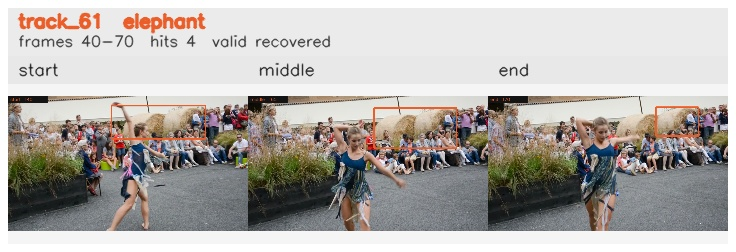

# davis__person_distractor__dance_twirl / track_61

## Summary
- class: elephant (20)
- frames: 40-70 (31 frame span)
- hits: 4
- valid track: yes
- had recovery: yes
- relinked from: none
- fragment track ids: 61
- avg visual similarity: 0.9253
- total misses: 6
- max miss streak: 3

## Label Mix
- elephant (20): 3 detections, confidence sum 0.861
- sheep (18): 1 detections, confidence sum 0.255

## Relink Edges
- none

## Event Timeline
- frame 40: created
- frame 45: lost
- frame 55: recovered
- frame 60: lost
- frame 65: recovered
- frame 70: closed
- frame 75: lost

## Key Frames
- start: frame 40, fragment 61, [image](frames/start_f0040.jpg)
- middle: frame 65, fragment 61, [image](frames/middle_f0065.jpg)
- end: frame 70, fragment 61, [image](frames/end_f0070.jpg)

[track metadata](track.json)
