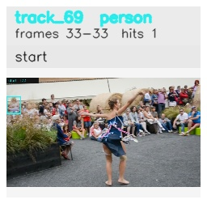

# davis__person_distractor__dance_twirl / track_69

## Summary
- class: person (0)
- frames: 33-33 (1 frame span)
- hits: 1
- valid track: no
- had recovery: no
- relinked from: none
- fragment track ids: 69
- avg visual similarity: n/a
- total misses: 7
- max miss streak: 7

## Label Mix
- person (0): 1 detections, confidence sum 0.272

## Relink Edges
- none

## Event Timeline
- frame 33: closed
- frame 33: created
- frame 34: lost

## Key Frames
- start: frame 33, fragment 69, [image](frames/start_f0033.jpg)

[track metadata](track.json)
