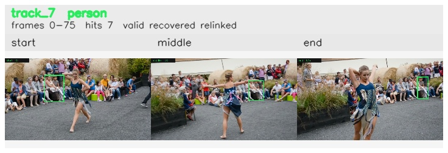

# davis__person_distractor__dance_twirl / track_7

## Summary
- class: person (0)
- frames: 0-75 (76 frame span)
- hits: 7
- valid track: yes
- had recovery: yes
- relinked from: 47, 59
- fragment track ids: 7, 47, 59
- avg visual similarity: 0.8738
- total misses: 22
- max miss streak: 7

## Label Mix
- person (0): 7 detections, confidence sum 3.466

## Relink Edges
- 7 -> 47 via dino (score 0.8471)
- 47 -> 59 via dino (score 0.8834)

## Event Timeline
- frame 0: created
- frame 5: activated
- frame 5: closed
- frame 10: lost
- frame 25: created
- frame 30: activated
- frame 35: closed
- frame 40: created
- frame 40: lost
- frame 45: lost
- frame 75: closed
- frame 75: recovered
- frame 80: lost

## Key Frames
- start: frame 0, fragment 7, [image](frames/start_f0000.jpg)
- middle: frame 30, fragment 47, [image](frames/middle_f0030.jpg)
- end: frame 75, fragment 59, [image](frames/end_f0075.jpg)

[track metadata](track.json)
