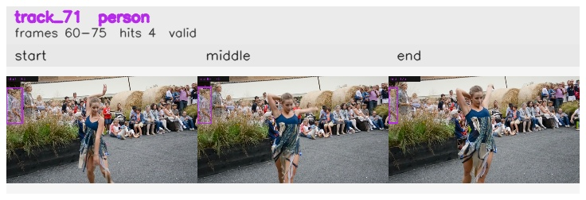

# davis__person_distractor__dance_twirl / track_71

## Summary
- class: person (0)
- frames: 60-75 (16 frame span)
- hits: 4
- valid track: yes
- had recovery: no
- relinked from: none
- fragment track ids: 71
- avg visual similarity: 0.9481
- total misses: 2
- max miss streak: 2

## Label Mix
- person (0): 4 detections, confidence sum 1.539

## Relink Edges
- none

## Event Timeline
- frame 60: created
- frame 65: activated
- frame 75: closed
- frame 80: lost

## Key Frames
- start: frame 60, fragment 71, [image](frames/start_f0060.jpg)
- middle: frame 70, fragment 71, [image](frames/middle_f0070.jpg)
- end: frame 75, fragment 71, [image](frames/end_f0075.jpg)

[track metadata](track.json)
