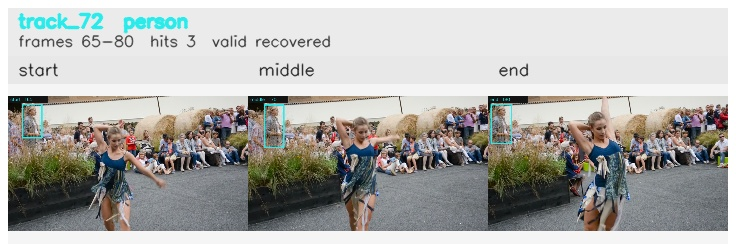

# davis__person_distractor__dance_twirl / track_72

## Summary
- class: person (0)
- frames: 65-80 (16 frame span)
- hits: 3
- valid track: yes
- had recovery: yes
- relinked from: none
- fragment track ids: 72
- avg visual similarity: 0.9464
- total misses: 2
- max miss streak: 1

## Label Mix
- person (0): 3 detections, confidence sum 1.168

## Relink Edges
- none

## Event Timeline
- frame 65: created
- frame 70: activated
- frame 75: lost
- frame 80: closed
- frame 80: recovered
- frame 85: lost

## Key Frames
- start: frame 65, fragment 72, [image](frames/start_f0065.jpg)
- middle: frame 70, fragment 72, [image](frames/middle_f0070.jpg)
- end: frame 80, fragment 72, [image](frames/end_f0080.jpg)

[track metadata](track.json)
