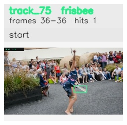

# davis__person_distractor__dance_twirl / track_75

## Summary
- class: frisbee (29)
- frames: 36-36 (1 frame span)
- hits: 1
- valid track: no
- had recovery: no
- relinked from: none
- fragment track ids: 75
- avg visual similarity: n/a
- total misses: 7
- max miss streak: 7

## Label Mix
- frisbee (29): 1 detections, confidence sum 0.291

## Relink Edges
- none

## Event Timeline
- frame 36: closed
- frame 36: created
- frame 37: lost

## Key Frames
- start: frame 36, fragment 75, [image](frames/start_f0036.jpg)

[track metadata](track.json)
