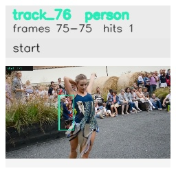

# davis__person_distractor__dance_twirl / track_76

## Summary
- class: person (0)
- frames: 75-75 (1 frame span)
- hits: 1
- valid track: no
- had recovery: no
- relinked from: none
- fragment track ids: 76
- avg visual similarity: n/a
- total misses: 2
- max miss streak: 2

## Label Mix
- person (0): 1 detections, confidence sum 0.265

## Relink Edges
- none

## Event Timeline
- frame 75: closed
- frame 75: created
- frame 80: lost

## Key Frames
- start: frame 75, fragment 76, [image](frames/start_f0075.jpg)

[track metadata](track.json)
