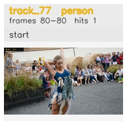

# davis__person_distractor__dance_twirl / track_77

## Summary
- class: person (0)
- frames: 80-80 (1 frame span)
- hits: 1
- valid track: no
- had recovery: no
- relinked from: none
- fragment track ids: 77
- avg visual similarity: n/a
- total misses: 1
- max miss streak: 1

## Label Mix
- person (0): 1 detections, confidence sum 0.257

## Relink Edges
- none

## Event Timeline
- frame 80: closed
- frame 80: created
- frame 85: lost

## Key Frames
- start: frame 80, fragment 77, [image](frames/start_f0080.jpg)

[track metadata](track.json)
