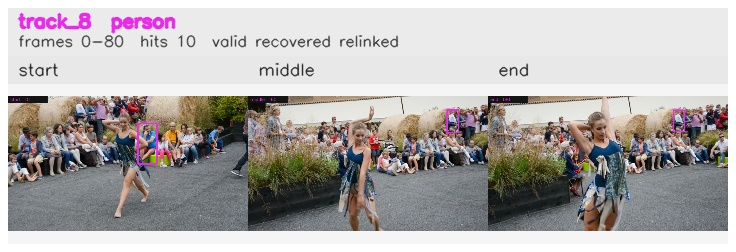

# davis__person_distractor__dance_twirl / track_8

## Summary
- class: person (0)
- frames: 0-80 (81 frame span)
- hits: 10
- valid track: yes
- had recovery: yes
- relinked from: 63
- fragment track ids: 8, 63
- avg visual similarity: 0.8619
- total misses: 11
- max miss streak: 7

## Label Mix
- person (0): 10 detections, confidence sum 3.230

## Relink Edges
- 8 -> 63 via spatial (score 0.4680)

## Event Timeline
- frame 0: created
- frame 5: activated
- frame 10: lost
- frame 20: closed
- frame 20: recovered
- frame 25: lost
- frame 45: created
- frame 50: lost
- frame 55: recovered
- frame 80: closed
- frame 85: lost

## Key Frames
- start: frame 0, fragment 8, [image](frames/start_f0000.jpg)
- middle: frame 60, fragment 63, [image](frames/middle_f0060.jpg)
- end: frame 80, fragment 63, [image](frames/end_f0080.jpg)

[track metadata](track.json)
