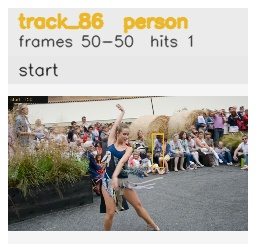

# davis__person_distractor__dance_twirl / track_86

## Summary
- class: person (0)
- frames: 50-50 (1 frame span)
- hits: 1
- valid track: no
- had recovery: no
- relinked from: none
- fragment track ids: 86
- avg visual similarity: n/a
- total misses: 7
- max miss streak: 7

## Label Mix
- person (0): 1 detections, confidence sum 0.335

## Relink Edges
- none

## Event Timeline
- frame 50: closed
- frame 50: created
- frame 51: lost

## Key Frames
- start: frame 50, fragment 86, [image](frames/start_f0050.jpg)

[track metadata](track.json)
