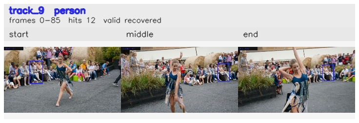

# davis__person_distractor__dance_twirl / track_9

## Summary
- class: person (0)
- frames: 0-85 (86 frame span)
- hits: 12
- valid track: yes
- had recovery: yes
- relinked from: none
- fragment track ids: 9
- avg visual similarity: 0.9213
- total misses: 6
- max miss streak: 6

## Label Mix
- person (0): 12 detections, confidence sum 6.995

## Relink Edges
- none

## Event Timeline
- frame 0: created
- frame 5: activated
- frame 10: lost
- frame 40: recovered
- frame 85: closed

## Key Frames
- start: frame 0, fragment 9, [image](frames/start_f0000.jpg)
- middle: frame 60, fragment 9, [image](frames/middle_f0060.jpg)
- end: frame 85, fragment 9, [image](frames/end_f0085.jpg)

[track metadata](track.json)
