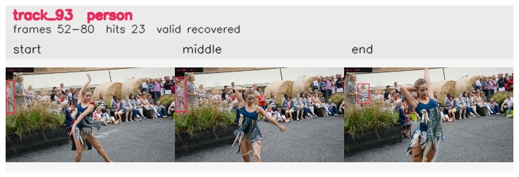

# davis__person_distractor__dance_twirl / track_93

## Summary
- class: person (0)
- frames: 52-80 (29 frame span)
- hits: 23
- valid track: yes
- had recovery: yes
- relinked from: none
- fragment track ids: 93
- avg visual similarity: 0.9692
- total misses: 13
- max miss streak: 7

## Label Mix
- person (0): 23 detections, confidence sum 8.599

## Relink Edges
- none

## Event Timeline
- frame 52: created
- frame 53: activated
- frame 55: lost
- frame 56: recovered
- frame 59: lost
- frame 60: recovered
- frame 76: lost
- frame 80: closed
- frame 80: recovered
- frame 81: lost

## Key Frames
- start: frame 52, fragment 93, [image](frames/start_f0052.jpg)
- middle: frame 65, fragment 93, [image](frames/middle_f0065.jpg)
- end: frame 80, fragment 93, [image](frames/end_f0080.jpg)

[track metadata](track.json)
