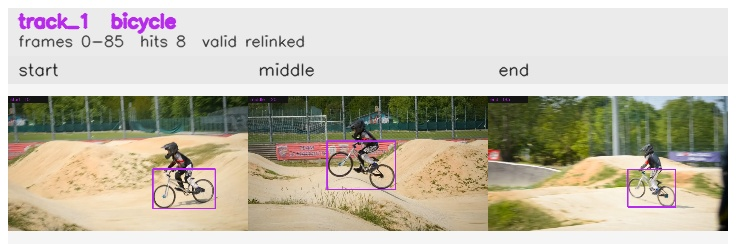

# davis__person_fast_motion__bmx_bumps / track_1

## Summary
- class: bicycle (1)
- frames: 0-85 (86 frame span)
- hits: 8
- valid track: yes
- had recovery: no
- relinked from: 4, 15
- fragment track ids: 1, 4, 15
- avg visual similarity: 0.8091
- total misses: 14
- max miss streak: 7

## Label Mix
- bicycle (1): 8 detections, confidence sum 7.053

## Relink Edges
- 1 -> 4 via dino (score 0.8912)
- 4 -> 15 via dino (score 0.7416)

## Event Timeline
- frame 0: created
- frame 5: activated
- frame 15: closed
- frame 20: created
- frame 20: lost
- frame 25: activated
- frame 25: closed
- frame 30: lost
- frame 80: created
- frame 85: activated
- frame 85: closed

## Key Frames
- start: frame 0, fragment 1, [image](frames/start_f0000.jpg)
- middle: frame 20, fragment 4, [image](frames/middle_f0020.jpg)
- end: frame 85, fragment 15, [image](frames/end_f0085.jpg)

[track metadata](track.json)
