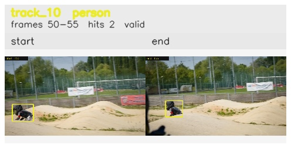

# davis__person_fast_motion__bmx_bumps / track_10

## Summary
- class: person (0)
- frames: 50-55 (6 frame span)
- hits: 2
- valid track: yes
- had recovery: no
- relinked from: none
- fragment track ids: 10
- avg visual similarity: 0.7638
- total misses: 6
- max miss streak: 6

## Label Mix
- person (0): 2 detections, confidence sum 1.232

## Relink Edges
- none

## Event Timeline
- frame 50: created
- frame 55: activated
- frame 55: closed
- frame 60: lost

## Key Frames
- start: frame 50, fragment 10, [image](frames/start_f0050.jpg)
- end: frame 55, fragment 10, [image](frames/end_f0055.jpg)

[track metadata](track.json)
