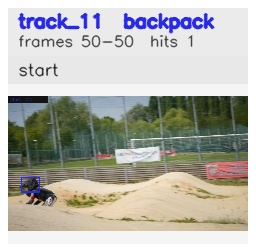

# davis__person_fast_motion__bmx_bumps / track_11

## Summary
- class: backpack (24)
- frames: 50-50 (1 frame span)
- hits: 1
- valid track: no
- had recovery: no
- relinked from: none
- fragment track ids: 11
- avg visual similarity: n/a
- total misses: 7
- max miss streak: 7

## Label Mix
- backpack (24): 1 detections, confidence sum 0.252

## Relink Edges
- none

## Event Timeline
- frame 50: closed
- frame 50: created
- frame 55: lost

## Key Frames
- start: frame 50, fragment 11, [image](frames/start_f0050.jpg)

[track metadata](track.json)
