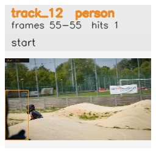

# davis__person_fast_motion__bmx_bumps / track_12

## Summary
- class: person (0)
- frames: 55-55 (1 frame span)
- hits: 1
- valid track: no
- had recovery: no
- relinked from: none
- fragment track ids: 12
- avg visual similarity: n/a
- total misses: 6
- max miss streak: 6

## Label Mix
- person (0): 1 detections, confidence sum 0.431

## Relink Edges
- none

## Event Timeline
- frame 55: closed
- frame 55: created
- frame 60: lost

## Key Frames
- start: frame 55, fragment 12, [image](frames/start_f0055.jpg)

[track metadata](track.json)
