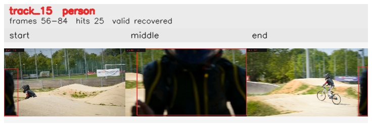

# davis__person_fast_motion__bmx_bumps / track_15

## Summary
- class: person (0)
- frames: 56-84 (29 frame span)
- hits: 25
- valid track: yes
- had recovery: yes
- relinked from: none
- fragment track ids: 15
- avg visual similarity: 0.9793
- total misses: 9
- max miss streak: 5

## Label Mix
- person (0): 25 detections, confidence sum 13.052

## Relink Edges
- none

## Event Timeline
- frame 56: created
- frame 57: activated
- frame 62: lost
- frame 63: recovered
- frame 66: lost
- frame 67: recovered
- frame 80: lost
- frame 82: recovered
- frame 84: closed
- frame 85: lost

## Key Frames
- start: frame 56, fragment 15, [image](frames/start_f0056.jpg)
- middle: frame 70, fragment 15, [image](frames/middle_f0070.jpg)
- end: frame 84, fragment 15, [image](frames/end_f0084.jpg)

[track metadata](track.json)
