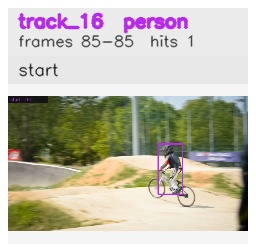

# davis__person_fast_motion__bmx_bumps / track_16

## Summary
- class: person (0)
- frames: 85-85 (1 frame span)
- hits: 1
- valid track: no
- had recovery: no
- relinked from: none
- fragment track ids: 16
- avg visual similarity: n/a
- total misses: 0
- max miss streak: 0

## Label Mix
- person (0): 1 detections, confidence sum 0.877

## Relink Edges
- none

## Event Timeline
- frame 85: closed
- frame 85: created

## Key Frames
- start: frame 85, fragment 16, [image](frames/start_f0085.jpg)

[track metadata](track.json)
