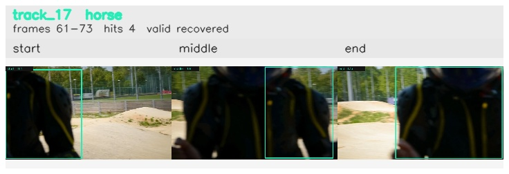

# davis__person_fast_motion__bmx_bumps / track_17

## Summary
- class: horse (17)
- frames: 61-73 (13 frame span)
- hits: 4
- valid track: yes
- had recovery: yes
- relinked from: none
- fragment track ids: 17
- avg visual similarity: 0.9714
- total misses: 16
- max miss streak: 7

## Label Mix
- horse (17): 2 detections, confidence sum 0.711
- person (0): 2 detections, confidence sum 0.545

## Relink Edges
- none

## Event Timeline
- frame 61: created
- frame 62: lost
- frame 64: recovered
- frame 65: lost
- frame 69: recovered
- frame 70: lost
- frame 73: closed
- frame 73: recovered
- frame 74: lost

## Key Frames
- start: frame 61, fragment 17, [image](frames/start_f0061.jpg)
- middle: frame 69, fragment 17, [image](frames/middle_f0069.jpg)
- end: frame 73, fragment 17, [image](frames/end_f0073.jpg)

[track metadata](track.json)
