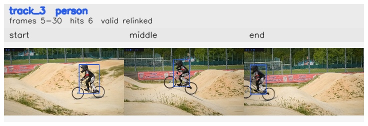

# davis__person_fast_motion__bmx_bumps / track_3

## Summary
- class: person (0)
- frames: 5-30 (26 frame span)
- hits: 6
- valid track: yes
- had recovery: no
- relinked from: 5
- fragment track ids: 3, 5
- avg visual similarity: 0.7732
- total misses: 14
- max miss streak: 7

## Label Mix
- person (0): 6 detections, confidence sum 5.091

## Relink Edges
- 3 -> 5 via dino (score 0.8464)

## Event Timeline
- frame 5: created
- frame 10: activated
- frame 20: closed
- frame 25: created
- frame 25: lost
- frame 30: activated
- frame 30: closed
- frame 35: lost

## Key Frames
- start: frame 5, fragment 3, [image](frames/start_f0005.jpg)
- middle: frame 20, fragment 3, [image](frames/middle_f0020.jpg)
- end: frame 30, fragment 5, [image](frames/end_f0030.jpg)

[track metadata](track.json)
