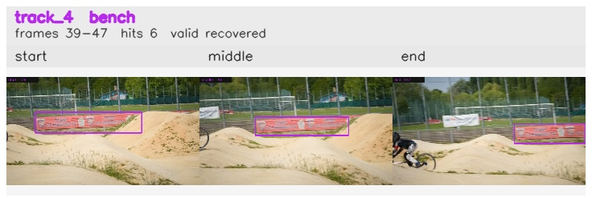

# davis__person_fast_motion__bmx_bumps / track_4

## Summary
- class: bench (13)
- frames: 39-47 (9 frame span)
- hits: 6
- valid track: yes
- had recovery: yes
- relinked from: none
- fragment track ids: 4
- avg visual similarity: 0.9785
- total misses: 10
- max miss streak: 7

## Label Mix
- bench (13): 6 detections, confidence sum 2.393

## Relink Edges
- none

## Event Timeline
- frame 39: created
- frame 40: activated
- frame 43: lost
- frame 44: recovered
- frame 45: lost
- frame 47: closed
- frame 47: recovered
- frame 48: lost

## Key Frames
- start: frame 39, fragment 4, [image](frames/start_f0039.jpg)
- middle: frame 42, fragment 4, [image](frames/middle_f0042.jpg)
- end: frame 47, fragment 4, [image](frames/end_f0047.jpg)

[track metadata](track.json)
