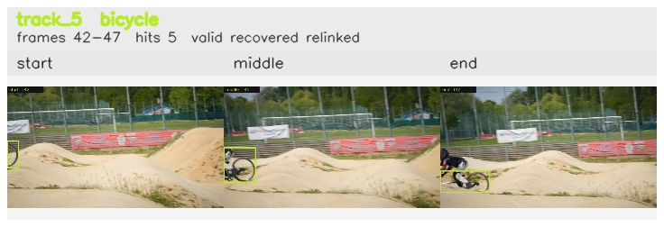

# davis__person_fast_motion__bmx_bumps / track_5

## Summary
- class: bicycle (1)
- frames: 42-47 (6 frame span)
- hits: 5
- valid track: yes
- had recovery: yes
- relinked from: 6
- fragment track ids: 5, 6
- avg visual similarity: 0.7504
- total misses: 15
- max miss streak: 7

## Label Mix
- bicycle (1): 5 detections, confidence sum 2.418

## Relink Edges
- 5 -> 6 via dino (score 0.7570)

## Event Timeline
- frame 42: created
- frame 43: lost
- frame 44: recovered
- frame 45: closed
- frame 46: created
- frame 46: lost
- frame 47: activated
- frame 47: closed
- frame 48: lost

## Key Frames
- start: frame 42, fragment 5, [image](frames/start_f0042.jpg)
- middle: frame 45, fragment 5, [image](frames/middle_f0045.jpg)
- end: frame 47, fragment 6, [image](frames/end_f0047.jpg)

[track metadata](track.json)
