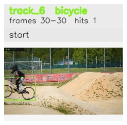

# davis__person_fast_motion__bmx_bumps / track_6

## Summary
- class: bicycle (1)
- frames: 30-30 (1 frame span)
- hits: 1
- valid track: no
- had recovery: no
- relinked from: none
- fragment track ids: 6
- avg visual similarity: n/a
- total misses: 7
- max miss streak: 7

## Label Mix
- bicycle (1): 1 detections, confidence sum 0.894

## Relink Edges
- none

## Event Timeline
- frame 30: closed
- frame 30: created
- frame 35: lost

## Key Frames
- start: frame 30, fragment 6, [image](frames/start_f0030.jpg)

[track metadata](track.json)
