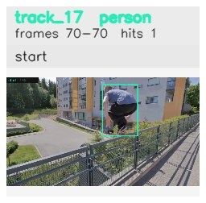

# davis__person_occlusion__parkour / track_17

## Summary
- class: person (0)
- frames: 70-70 (1 frame span)
- hits: 1
- valid track: no
- had recovery: no
- relinked from: none
- fragment track ids: 17
- avg visual similarity: n/a
- total misses: 5
- max miss streak: 5

## Label Mix
- person (0): 1 detections, confidence sum 0.897

## Relink Edges
- none

## Event Timeline
- frame 70: closed
- frame 70: created
- frame 75: lost

## Key Frames
- start: frame 70, fragment 17, [image](frames/start_f0070.jpg)

[track metadata](track.json)
